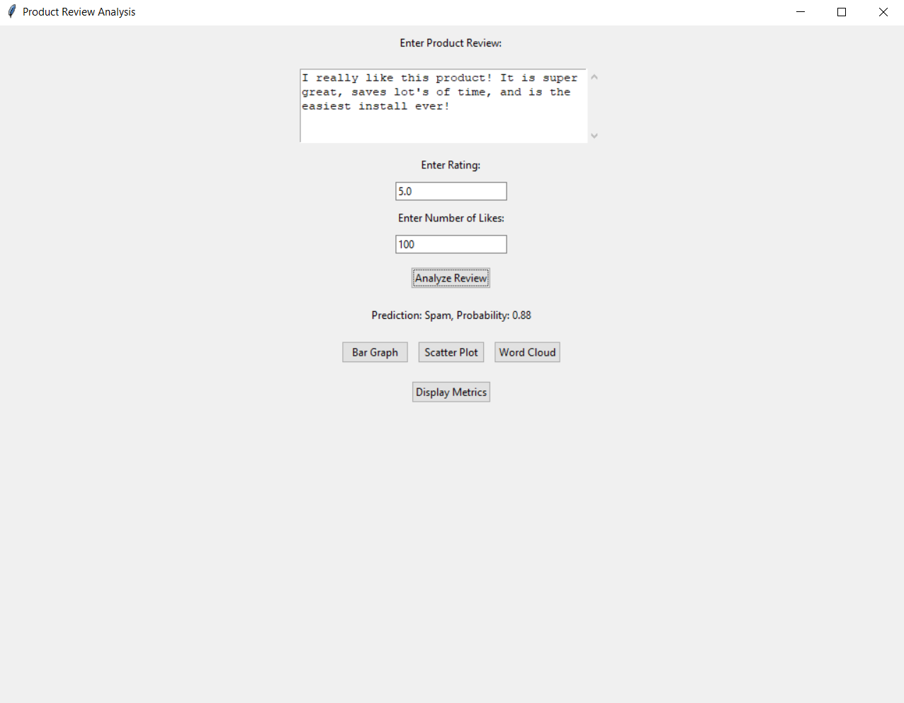
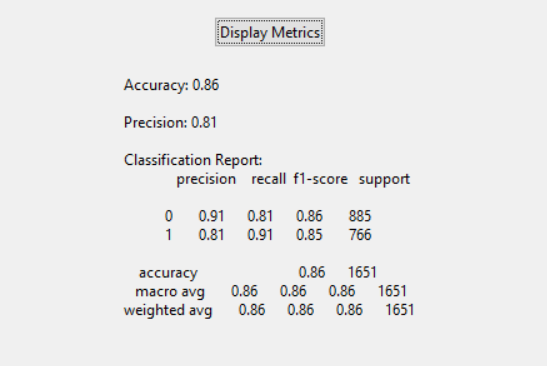
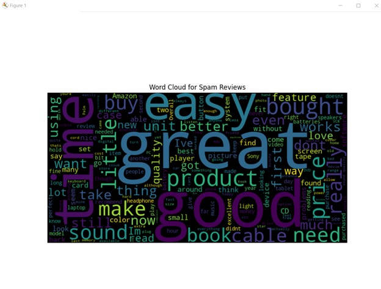
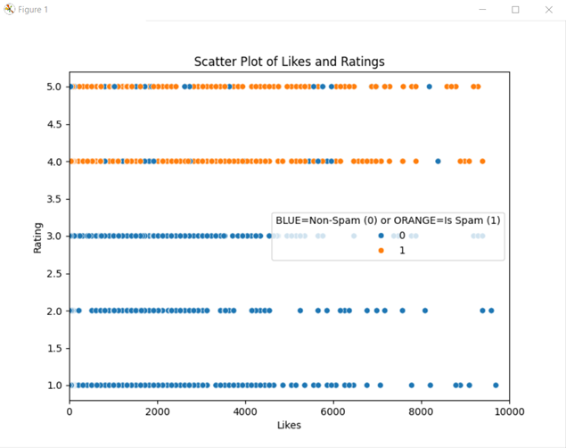
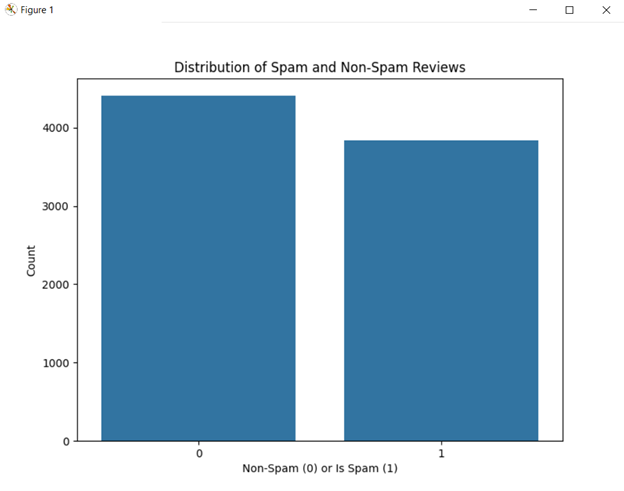
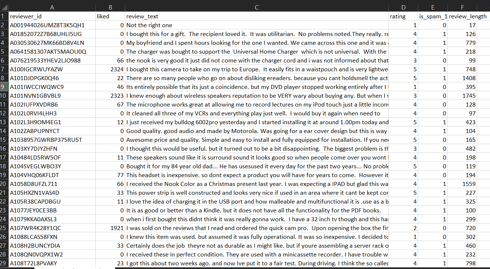

# AI-ML-Spam-review-detector
This is an AI model using Machine Learning and the Logistics Regression ALgorithm to detect Spam reviews on Ecommerce sites. It takes a set of data using Pandas in the form of a CSV, and then uses the SKlearn library to run the Algorithm to train the model.  

To install (NOTE: this executable only works on Windows 10 Operating systems): 
1. Download the zipfile labeled: "AI_SpamDetector.zip". 
2. Once downloaded, extract the file to your prefered location.  
3. Make sure the Executable file is in the same location as the dataset. (same as when unzipped initially)  
4. Launch the executable, enter your review data, and click the "Analyze Review" button. 
5. An output on whether the review is Spam, and the probability of the AI thinks it's right will be printed in the center. 
6. (OPTIONAL) if you wish to change the dataset, simply follow the "electronics_b_quotations" structure to add your own reviews.

Here is an example of the program with a review entered in: 

 

Here is the overall accuracy of the AI model for detecting Spam reviews, based on this training set: 
 
 

Several graphs are included, these graphs are updated automatically, based on the dataset.
Here is an example of the word cloud for common words used in Spam reviews: 
 
 

You can see how the data is biased towards ratings of 5.0 based on number of likes here: 
 
 

Lastly, if you wish to see how many of each Spam vs Non-spam reviews were used you can look at the bar graph: 
 
 

Here is an example of the data: 
 
 

The data was taken from https://www.kaggle.com/datasets/naveedhn/amazon-product-review-spam-and-non-spam/discussion  
and then preprocessed by myself to train the model.

THIS PROJECT IS NOT INTENDED TO BE FOR SALE AND IS NOT TO BE USED FOR THE PURPOSES OF RESALE.
